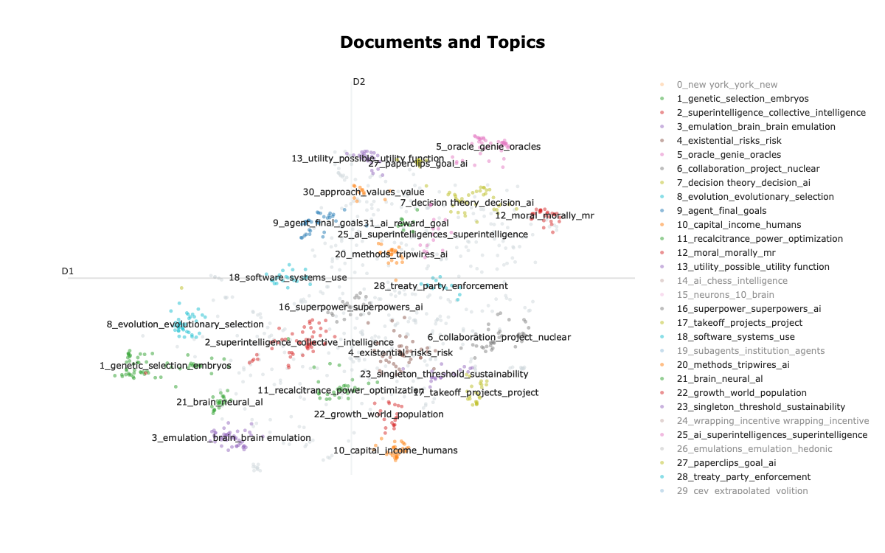
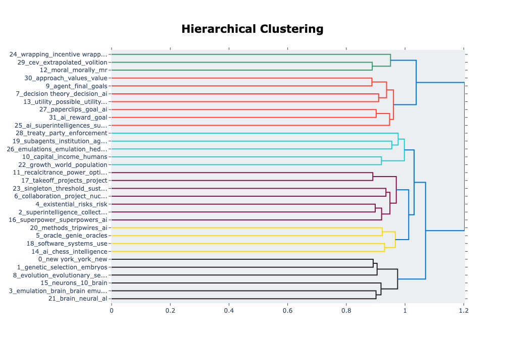

# DeepRead: Quantifying Knowledge in Text

## What it does

This project uses AI-driven topic modeling to analyze EPUB files and visualize the evolution of themes throughout a book.
By tracking how topics change over time and clustering related concepts, it creates intuitive visual representations that make complex narratives more digestible, and aids in knowledge discovery.
The tool enables users to quantify a book’s information content.
Through dynamic visualizations, readers and researchers can easily detect patterns, key ideas, and knowledge distribution across the text.

## Visualizations

